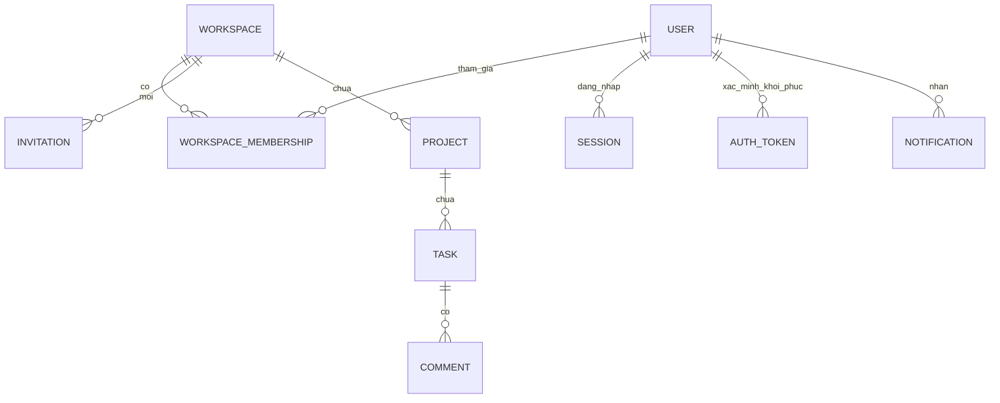

# Mô hình dữ liệu v0.1 — conceptual

Ngày 03/10/2026. Bản thiết kế ban đầu từ SRS và các quyết định hiện tại; chưa phải schema Mongoose/collection/index đã thông qua. BE dùng JS/Express/Mongoose làm nền hiện tại, có thể điều chỉnh với quyết định có lý do. Thư viện FE chọn trong thiết kế/code, không khóa toàn bộ trước wireframe.

## 1. Quan hệ chính

Thiết kế hiện hành đã chỉnh sửa: DATABASE-DESIGN-v0.2.md, DATABASE-LAYOUT-v0.2.json và DATABASE-ERD-v0.2.md. Có 12 collection lõi; announcement/idempotency là mở rộng chờ phase/policy, storage Upcoming. Owner role derived, Google-only passwordHash nullable và membership history giữ định danh User. Các link v0.1 bên dưới là lần thiết kế trước.

Đã triển khai bản thiết kế vật lý dự thảo tại [DATABASE-DESIGN-v0.1.md](../archive/sds/v0.1/DATABASE-DESIGN-v0.1.md) và [DATABASE-ERD-v0.1.md](../archive/sds/v0.1/DATABASE-ERD-v0.1.md), ngày 03/10/2026. Chọn Owner từ Workspace.ownerId, membership role được tính khi trả API; Task/Comment có workspaceId do server lấy từ parent. Đây là design draft, chưa có Mongoose models/index thật.

Task có Creator và tối đa một Assignee; Comment có Author; quan hệ lịch sử tới User không tự cấp quyền. Diagram thể hiện quan hệ nghiệp vụ, không đầy đủ foreign keys và không cam kết xóa cascade vật lý.

## 2. Đối tượng và dữ liệu cần quản lý

| Đối tượng | Trách nhiệm/dữ liệu conceptual | Điều kiện thiết kế |
|---|---|---|
| User | Email, tên hiển thị, password hash, verified, Terms version/time; locale và email setting chung | Không trả credential ra API; locale policy còn đề xuất |
| Workspace | Tên, mô tả rich text, một Owner hiện tại, timestamps/version | Chọn nguồn lưu ownership duy nhất, tránh ownerId/role độc lập bị lệch |
| Membership | User + Workspace, vai trò/lifecycle gia nhập, email overrides | Một membership hiện tại mỗi cặp; rời xóa override, không xóa danh tính User |
| Invitation | Workspace, người mời, EMAIL/LINK, email nhận nếu EMAIL, token bảo vệ, expiry/revoke/accept | Token không có trong API danh sách; chỉ endpoint tạo/link hợp lệ cho quyền thích hợp; chuyển Owner giữ hiệu lực lời mời |
| Project | Workspace, tên/mô tả rich text, Active/Archived, creator, timestamps/version | Quyền quản lý Owner; mọi Member xem theo Workspace |
| Task | Project, Creator, title, rich text description, status, assignee, due time, timestamps/version | Quyền từng hành động; thời gian tạo không đổi khi edit/status; chưa chọn có denormalize workspaceId hay không |
| Comment | Task, Author, rich text content, timestamps/version | Chỉ Author hiện tại sửa/xóa trong Active |
| Notification | Recipient, event/template key, dữ liệu được phép, target/context, thời điểm/read state | Xem lại quyền khi trả kết quả; che payload khi mất quyền/target xóa |
| Session | User, expiry/revocation và dữ liệu cần cho quản lý phiên | Dùng dù session cookie hoặc JWT cần revocation; chưa chọn auth mechanism |
| Auth token | User, purpose, token hash, expiry/used/revoked | Verification/recovery không dùng làm login credential; token raw chỉ xuất hiện ở luồng gửi hợp lệ |
| Email delivery/outbox | Event/recipient, trạng thái xử lý, attempts, retry time, dedup key | Gửi sau commit; kiểm lại quyền/settings; không hứa provider exactly-once |
| Create-operation record | Định danh lần gửi tạo, User/phạm vi, trạng thái/kết quả | Đề xuất phục vụ idempotency; nhóm 6 chưa duyệt phạm vi/thời hạn |

Đối tượng conceptual không bắt buộc một collection tương ứng. SDS schema tiếp theo quyết định embed/reference, index, lifecycle, transaction và kích thước tối đa.

## 3. Những invariant schema/API phải bảo đảm

1. Workspace có đúng một Owner hiện tại; transfer/leave không tạo nhóm thiếu Owner hoặc hai Owner.
2. Một User không có membership hiện tại trùng; accept/revoke có kết quả nhất quán.
3. Task/Comment/Project luôn có ngữ cảnh Workspace xác định; query/mutation không cho client đổi ngữ cảnh hoặc Creator/Author tùy ý.
4. Phân công mới chỉ tới Member hiện tại; giữ lịch sử Done và cleanup chưa Done cả Archived theo OD-01.
5. Sửa stale không ghi đè; mất quyền hoặc archive được kiểm lại lúc ghi. Token còn hạn không thay thế các kiểm tra này.
6. Rich text dùng chung format/schema version cho mô tả Workspace/Project/Task và Comment, với giới hạn từng trường; backend validation bắt buộc. Text trích xuất phục vụ search/preview/count không trở thành bản sao nghiệp vụ độc lập.
7. Deadline là một thời điểm lưu UTC; locale Việt/Anh không làm đổi timezone hiển thị đã chốt. Không lưu overdue làm nguồn sự thật độc lập.
8. My Tasks là query từ Task + quyền/membership, không collection sao chép; search/filter/pagination áp dụng toàn tập được phép.
9. Email setting global/override theo quy tắc đã duyệt; queued email kiểm lại quyền/settings. Notification không lộ nội dung sau mất quyền.

## 4. Chuyển thành schema vật lý

Lần thiết kế tiếp theo cần chốt: nguồn ownership, membership current/history, rich-text representation, session mechanism, query/index cho Board/My Tasks, version checks và các transaction cần thiết. Retention/purge/backup còn mở và phải ghi rõ, không giả định hard-delete toàn bộ lịch sử. Unique index và transaction phải được chứng minh bằng trường hợp cạnh tranh khi có code.

Auth/User/Membership/Project/Task là cụm thiết kế đầu; Invitations/Comment/Notification/Email theo sau để giữ luồng end-to-end. Chưa kết nối database hoặc triển khai model từ bản này.
