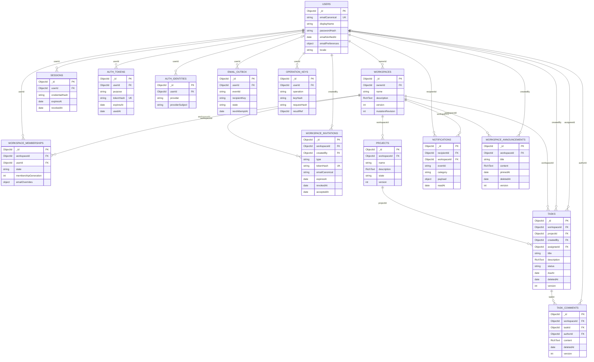

# Sơ đồ quan hệ DB v0.1

Sơ đồ này là lịch sử trước khi tách phạm vi lõi; dùng [ERD v0.2](DATABASE-ERD-v0.2.md) và [layout v0.2](DATABASE-LAYOUT-v0.2.json) cho thiết kế hiện tại.

Ngày 03/10/2026. Sơ đồ của DATABASE-DESIGN-v0.1.md; references là quan hệ service bảo đảm, không phải foreign-key enforcement tự động của MongoDB. Chưa tạo models/index/database.

Diagram chỉ hiển thị fields quan trọng; data dictionary chứa nullable/default/private/timestamps đầy đủ. `credentialHash` trong sessions là ứng viên session-cookie; JWT mode dùng refresh fields khác. `operation_keys` còn phụ thuộc scope idempotency nhóm 6.

`RichText` là embedded object dùng chung, không collection. User settings và membership overrides cũng embedded. `Owner` là quyền tính từ Workspace.ownerId và membership active, không collection hoặc role thứ hai lưu song song.

Đọc task hierarchy theo Project → Workspace; workspaceId denormalized ở Task/Comment phải khớp parent. Diagram không có nghĩa User/Workspace purge cascade đã được duyệt.
