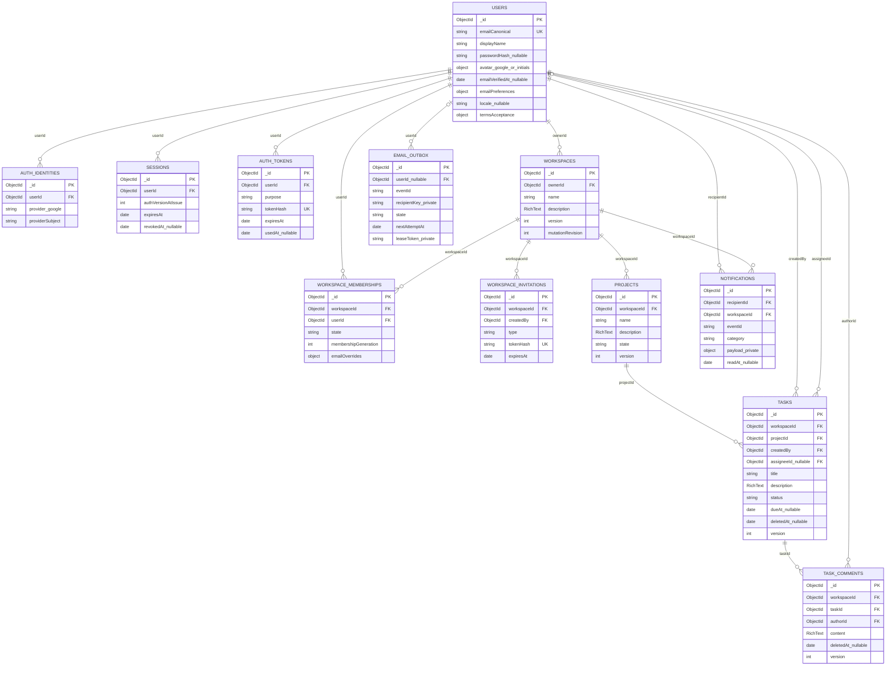

# Quan hệ dữ liệu v0.2 — phần lõi

Ngày 03/10/2026. Đi cùng DATABASE-DESIGN-v0.2.md và DATABASE-LAYOUT-v0.2.json. References dưới đây phải được BE enforce, không phải MongoDB tự bảo đảm foreign keys. Đã có 12 models tại BE; chưa tạo database/index hoặc triển khai các giao dịch nghiệp vụ.

Suffix `_nullable`/`_private` là ghi chú diagram, không tên field DB; layout JSON giữ tên chính xác. Sơ đồ rút gọn trường/quan hệ; references workspaceId/parent ở Task/Comment và các target references đầy đủ ở layout.

Owner nằm ở workspaces.ownerId, membership role tính khi truy cập. RichText/settings/Terms embedded, không collection. Sessions chọn một credential variant sau khi chốt auth, sơ đồ không ép JWT hoặc cookie.

workspace_announcements/operation_keys nằm ở mục mở rộng chờ phase/policy của thiết kế, không trong ERD lõi. Storage/resources là Upcoming. Không mảng attachments, file object hoặc upload avatar trong lõi hiện tại.
