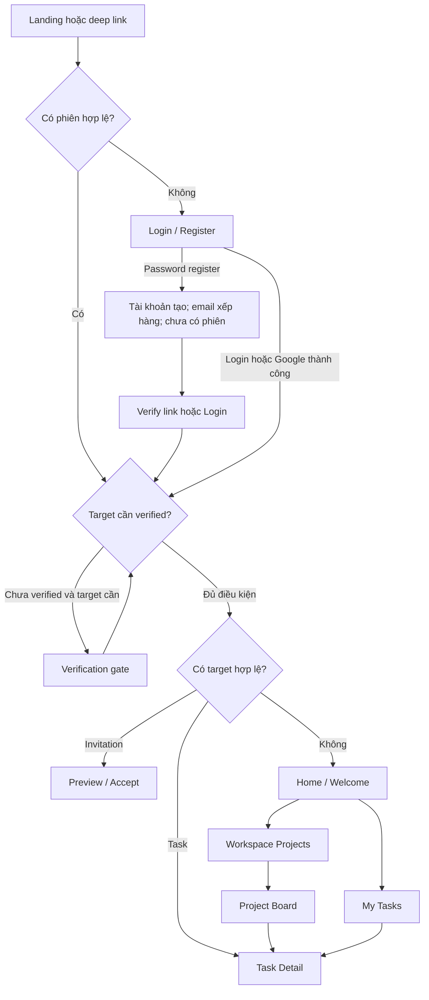
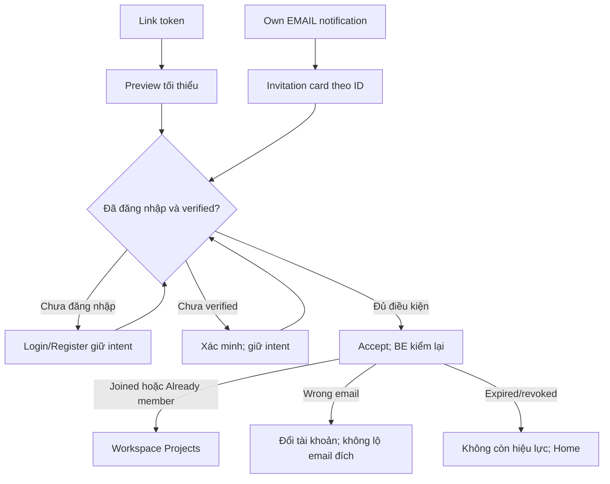

# Screen flow v0.2 — review trước wireframe

03/10/2026. Dùng [screen spec hiện hành](SCREEN-SPEC-v0.2.md) và [gap log](UI-API-GAPS-v0.1.md); phủ 35 UC và BE core đã có. Các routes dưới là đề xuất FE, không phải endpoints BE hoặc quyết định router/library. Không tạo Figma/canvas, không thay requirements đã chốt.

## 1. Sitemap đề xuất

```text
/                              Landing
/terms, /privacy               Policy template
/login, /register              Auth
/verify-email                  Verify-link result hoặc verified gate
/forgot-password
/reset-password
/invite                        Public token preview/accept, fragment intent
/invitations/:id               Own EMAIL invitation qua inbox, auth required

/app                           Home/Welcome theo dữ liệu thật
/my-tasks                      Assigned-to-me cross-workspace
/notifications                 Own inbox
/settings/profile
/settings/account
/settings/email
/workspaces/:id                Projects/description overview
/workspaces/:id/members
/workspaces/:id/invitations     Owner
/workspaces/:id/settings        Owner group information
/workspaces/:id/email           Own overrides, mọi Member
/projects/:id                  Board + Project info
/tasks/:id                     Task detail canonical route
```

Create/edit/confirm dialogs không cần route riêng trừ khi mobile/history yêu cầu; lựa chọn phải giữ deep link/back hợp lý. Announcements route dự kiến /workspaces/:id/announcements chỉ thêm khi phase có BE. Không routes Files/Resources trong increment này.

## 2. Journey đăng nhập và first use



Gate chỉ áp tác vụ Workspace/Task, không chặn Profile/Personal Settings/own invitation inbox. Google login có TERMS_REQUIRED thì consent rồi tiếp tục; ACCOUNT_LINK_REQUIRED thì local login → Account Link Google. Không auto-link hoặc auto-register password từ Google flow. Intent hết hạn/không còn quyền hiển thị state và đường về Home, không lặp Login vô hạn.

## 3. Journey invitation



Public preview không chứa danh sách thành viên/Task; EMAIL ID chỉ nhận đúng recipient email, LINK vẫn theo token. Không consume invitation khi chưa verified. Sau Workspace join refresh memberships/context; zero-workspace Welcome không chen ngang lời mời. Token không có trong list invitation sau creation; Owner copy LINK ngay lúc tạo.

## 4. Journey công việc

Workspace Projects → Board → Create Task trong context Project Active → Task Detail → Comment. Mọi Member tạo Task/Comment; quản lý Project chỉ Owner. Sau tạo, status Chưa làm; tự giao không tự notification. Từ My Tasks/Notification/direct URL cùng mở Task Detail với kiểm quyền tại request.

Task Detail có ba nhóm action độc lập: edit content/assignment/deadline, status, delete. Chọn trạng thái cho phép chuyển trực tiếp giữa ba trạng thái, không tự sắp card trong cột. Form content đang dirty mà user đổi status: cần phối hợp version và cảnh báo dữ liệu changed; không gửi hai mutations từ cùng version song song rồi báo chung success. Bản đầu nên hoàn thành Save/Cancel trước đổi status, hoặc block status khi content form đang dirty với hướng dẫn rõ.

Comments Save/Cancel độc lập version Task, không yêu cầu Save Task để gửi comment. Task delete che toàn bộ Comments; archived chặn composer/edit/status. Owner mở lại Project rồi thao tác, không “bypass archived” trong dialog Task.

Back/Close từ Task panel trả lại background list/Board và filters đã tải. Direct link hoặc reload Task có full-page fallback; không giả browser history chứa một Project đã tải. Nếu Task vừa mất quyền/xóa, không giữ card/message private trong background sau khi xác định unavailable.

## 5. Journey ownership / rời nhóm

Member: Members hoặc Workspace context → Leave confirm → thành công clear Workspace/Task cache → Home. Owner: action Leave → Transfer dialog → chọn Member hiện tại → confirm → role Member → Leave confirm. Transfer không tự leave; hai hành động riêng vì Owner có thể muốn ở lại.

Owner remove Member → confirm ảnh hưởng quyền/assignee → BE kiểm membership version → refresh list. Stale do người đó rejoin không auto-retry version mới. Transfer làm Owner cũ mất menu management, Owner mới được menu, invitations còn hiệu lực; Task Creator rights độc lập ownership.

## 6. Journey notification / settings

Open Notifications → read filters/page/count → choose work target → mark read theo chủ ý → Task Detail. Unavailable không có link, vẫn mark read; không đọc tất cả những mục mới đến sau cutoff đã tải. EMAIL invitation đưa tới card accept, không lấy raw token từ outbox. Rejoin làm mapper có thể hiện lại mục cũ nếu quyền hiện tại hợp lệ.

Settings Profile/Language dùng User version; Global Email và Workspace override khác scope/version, có nút Save riêng. Đổi global không overwrite on/off; Reset override về inherit. Save setting không phải thao tác gửi email và không phát notification mới.

## 7. Transition/error rules

| Trigger | Hành vi UI |
|---|---|
| App boot/refresh session | Loading trước xác định route; không flash dữ liệu user khác hoặc Welcome giả |
| Unauthorized session | Login giữ local known intent; không giữ draft password hoặc cache riêng của user cũ |
| Unverified cần Workspace | A03 + hướng verified, không fetch private data phía sau gate |
| RESOURCE_UNAVAILABLE | Generic không còn khả dụng, clear private content, về context còn quyền |
| OWNER_REQUIRED/quyền Task/Comment mất | Refresh permission/context, bỏ action cũ, không show success |
| PROJECT_ARCHIVED | Read-only banner; giữ bản người dùng đang nhập để copy, Owner có reopen |
| VERSION_CONFLICT | Copy draft / tải bản mới / sửa lại; không auto-merge hoặc force overwrite |
| ASSIGNEE_NOT_MEMBER | Reload picker, yêu cầu chọn lại; không thay bằng người khác âm thầm |
| Network error khi create | Giữ draft, không auto-retry có thể tạo trùng; kiểm dữ liệu đã lưu trước gửi lại |
| Query/date invalid | Lỗi filter, kết quả gần nhất ghi rõ chưa áp dụng; không giả 0 kết quả |

API error codes không dùng làm text sản phẩm; message dịch Việt/English giữ cùng ý nghĩa. Prototype sau này cần đi được happy paths và các nhánh quan trọng này, không chỉ nối frames thành chuỗi.
